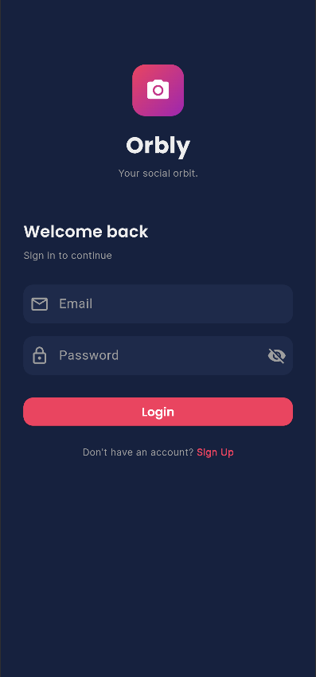
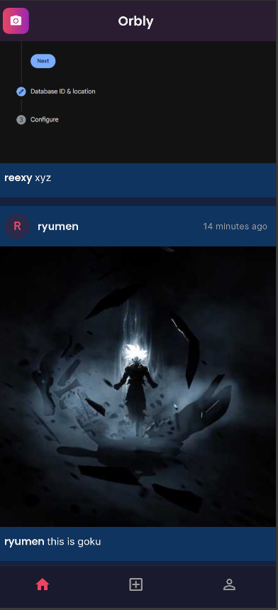
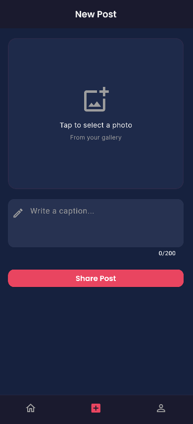
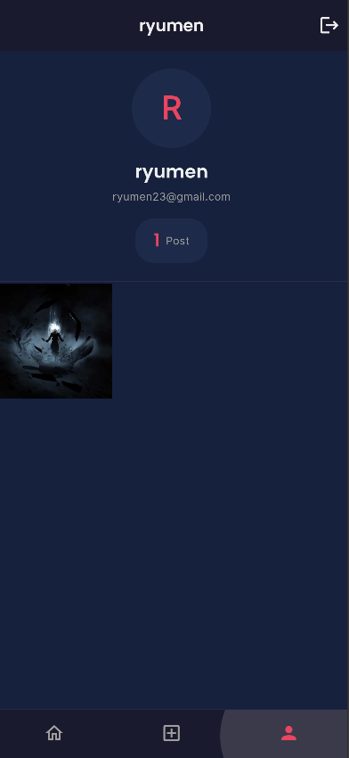

# 🪐 Orbly

> *Your social orbit.*

A social media mobile application inspired by Instagram, built with Flutter and Firebase.

---

## 📱 Screenshots

| Login | Feed | Create Post | Profile |
|---|---|---|---|
|  |  |  |  |

---

## ✨ Features

- 🔐 **User Authentication** — Sign up, login, and logout securely with Firebase Auth
- 👤 **User Profile** — View your profile picture, username, and post count
- 📸 **Create Posts** — Pick images from your gallery and share with a caption
- 🏠 **Home Feed** — Browse posts from all users in real-time
- 🕐 **Timestamps** — Posts show relative time (e.g. "2 hours ago")
- 🌙 **Dark Mode UI** — Clean, modern dark theme throughout

---

## 🛠️ Tech Stack

| Technology | Purpose |
|---|---|
| Flutter | Cross-platform UI framework |
| Firebase Authentication | User login & registration |
| Cloud Firestore | Database for users and posts |
| Google Fonts | Typography (Poppins & Inter) |

---

## 📂 Project Structure

lib/
├── main.dart                  # App entry point
├── firebase_options.dart      # Firebase config (auto-generated)
├── models/
│   ├── user_model.dart        # User data structure
│   └── post_model.dart        # Post data structure
├── services/
│   ├── auth_service.dart      # Login, signup, logout
│   ├── post_service.dart      # Create & fetch posts
│   └── storage_service.dart   # Image to Base64 conversion
├── screens/
│   ├── login_screen.dart      # Login page
│   ├── signup_screen.dart     # Registration page
│   ├── home_screen.dart       # Main screen with nav bar
│   ├── feed_screen.dart       # All posts feed
│   ├── create_post_screen.dart# Upload a new post
│   └── profile_screen.dart    # User profile & posts grid
├── widgets/
│   ├── post_card.dart         # Single post component
│   └── loading_button.dart    # Button with loading spinner
└── utils/
└── app_theme.dart         # Colors, fonts, theme

---

## 🚀 Getting Started

### Prerequisites
- Flutter SDK
- Firebase account
- Android Studio or VS Code

### Installation

1. **Clone the repository**
```bash
   git clone https://github.com/YOUR_USERNAME/orbly.git
   cd orbly
```

2. **Install dependencies**
```bash
   flutter pub get
```

3. **Connect Firebase**
```bash
   flutterfire configure
```

4. **Enable Firebase services**
   - Authentication → Email/Password
   - Firestore Database → Test mode
   - Firebase Storage (optional)

5. **Run the app**
```bash
   flutter run
```
---

## 📦 Packages Used

| Package | Version | Purpose |
|---|---|---|
| firebase_core | ^3.6.0 | Firebase initialization |
| firebase_auth | ^5.3.1 | User authentication |
| cloud_firestore | ^5.4.4 | Database |
| image_picker | ^1.0.7 | Pick photos from gallery |
| timeago | ^3.6.1 | Relative timestamps |
| uuid | ^4.3.3 | Unique post IDs |
| google_fonts | ^6.1.0 | Custom typography |

---

## 👨‍💻 Developer

**Built during internship at [CodeXcelerate IT Consultancy](https://www.codexcelerate.me/)**

This project was assigned as part of the internship program at CodeXcelerate IT Consultancy to gain hands-on experience in building real-world mobile applications using Flutter and Firebase.

### 🎯 What I learned
- User authentication flow with Firebase Auth
- Real-time database management with Firestore
- Image handling and Base64 encoding
- Building a clean social media UI with Flutter
- Project structure and clean code practices

---

> *Built with 💙 using Flutter & Firebase*
> 
> Internship Project — CodeXcelerate IT Consultancy

---

## 📄 License

This project is open source and available under the [MIT License](LICENSE).